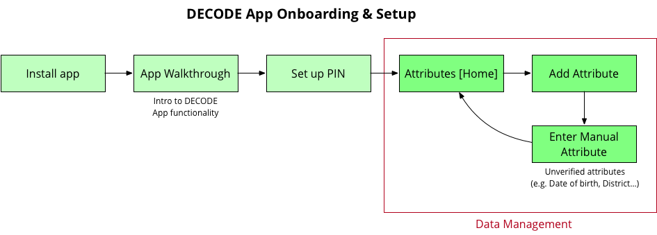
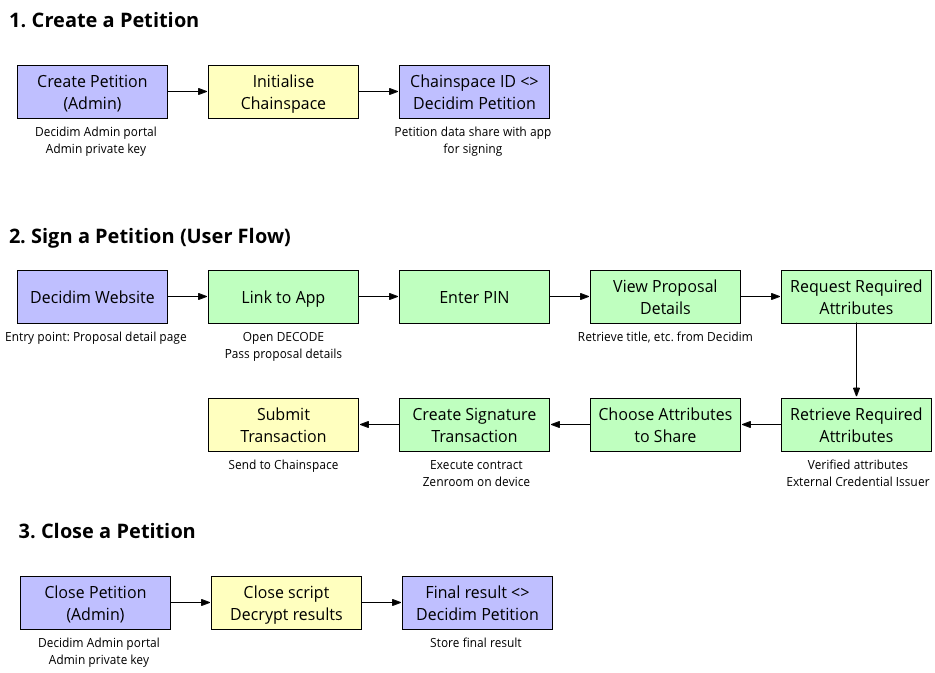
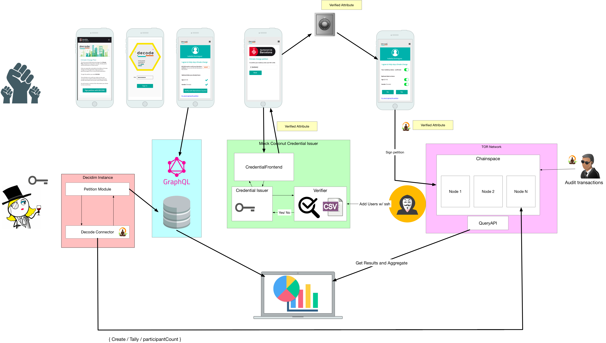

# The App

## Table of contents

- [Decode App](#the-app)
  - [Features description](#features-description)
  - [Code structure](#code-structure)
  - [Commands](#commands)
  - [Publishing](#publishing)
  - [Future development](#future-development)
- [Integration and Deployment](#integration-and-deployment)
  - [Pipelines](#pipelines)
- [Dependencies](#dependencies)
  - [Chainspace](#chainspace)
  - [Zenroom](#zenroom)
  - [Tor proxy](#tor-proxy)
- [Pilots](#pilots)
  - [Decode Connector](#decode-connector)
  - [Crendential Issuer](#credential-issuer)
  - [Verifier](#verifier)
  - [Decidim](#decidim)
- [Glossary](#glossary)

---

## The App
This app provides a platform where people can control their personal data, choosing where and how to share it. It allows users to input their data and keep it saved on their phone for future use. Currently, there is also a signing flow for integration with a community engagement platform called Decidim. It allows the user to share anonymised data and vote on a petition securely.

See [Glossary](#glossary) for unknown terms.

### Features Description

#### Decode App Onboarding and setup



##### Walkthrough

In order to inform the user about the benefits of using this app, we have included a Walkthrough.

This Walkthrough is a swipeable multi-page component with modifiable images and texts and the ability to skip.

##### Pin Management

In order to secure the app, the authentication system included is PIN based. When you first visit the app and reach the end of the Walkthrough, you will be required to set up a PIN. Subsequently, in order to access the app you must enter your PIN.

By design and for maximum privacy and security of personal data, there is no way to retrieve the PIN if you forget it. It is only saved in the Local Storage of the phone.

##### Data Management

The app includes a Data summary page where you can view all data you have in the app. The app distinguishes between verified and unverified data. Currently, from this page you can add more unverified data by clicking the button on the bottom. This redirects you to the data addition page where you can add new data. The data is stored in the local storage of the phone, it is not saved in any external database. You also have the option to edit data already saved in the app.

Verified data, in the form of signed credentials, can only be imported from external credential issuers as part of a specific pilot or application.

#### Signing Flow

The signing flow was created specifically for the Decidim Pilot. In this flow, you enter the app through an external link from the [Decidim site](https://dddc.decodeproject.eu/).

### Code Structure

#### The Tech Stack

The app is developed using [React Native](https://facebook.github.io/react-native/) as the main language and [Redux](https://redux.js.org/) as the state manager.

The app is being developed using [Docker](https://www.docker.com/) to build and manage testing environments.

As part of the development tools, we are using [Expo](https://expo.io/) to simulate an iOS and Android environment. Expo allows us to create the different files in order to publish in the different app stores. It also provides tools for managing the app navigation, environment variables and the secure storage.

[react-i18next](https://github.com/i18next/react-i18next) library is used to manage localization, currently with English, Spanish and Catalan languages.

Git and github are the version control system.

Jest is used for testing with [Enzyme](https://github.com/airbnb/enzyme) as the React testing framework.

#### Project Structure

The project is separated into the following main sections


| Folder                    | Description   |
| ------------------------- |:-------------:|
| */application/components* | Custom components |
| */application/redux*      | State management |
| */screens*                | Page components |
| */translations*           | Translation files |
| */lib*                    | Application logic |
| */test/acceptance*        | Attempt at writing a high level test |
| */test/components*        | Component tests |
| */test/snapshot*          | Snapshot tests |
| */test/unit*              | Unit test files for Application logic and Redux actions and reducers |


### Commands

In order to simplify the necessary commands to setup the app, we use Make.


#### Pre-Requisites

- [Expo](https://expo.io/)
```
npm install -g exp
```

- [Node](https://nodejs.org)

Version 8 or higher


#### Install dependencies

In a terminal window run:
```
npm install
```

#### Testing

```
npm test
```
or
```
npm test-watch
```

#### Linting

```
npm run lint
```

##### NOTE:

All of these commands can also be run inside a Docker container that uses Node 10:

```
make build

make test

make test/watch

make lint
```

#### Launching the Emulator

This is the same for both Node versions

Launch for iOS
```
npm run ios
```

or Android
```
npm run android
```

### Publishing

#### Expo

Since we've built the app with Expo, it can easily be published with the following command:

```
exp publish --release-channel=production
```

The latest version of the app is available [here](https://expo.io/@decode-barcelona/decode-walletapp?release-channel=production).

If you're using an Android phone you can just use the QR code to open the app.

Unfortunately, Expo QR codes don't work on the latest versions for iPhone.

#### IOS

Before publishing, you must update the build number in app.json

In order to generate the files necessary for publishing run the following command

```
exp build:ios
```

Once you have the IPA, follow the normal process for uploading apps to the apple store or test flight.

#### Android

Before publishing, you must update the version code in app.json

In order to generate the files necessary for publishing run the following command

```
exp build:android
```

Once you have the APK, follow the normal process for uploading apps to Google Play.

###### NOTE:

We have had trouble when publishing to Google Play in the past. The links we used in the app do not work the same way as they had in Expo, with no solution to be found:

- When returning to the app from the Credential Issuer site, the 'url' event handler is not triggered and the credential is not stored.
- We believe that it's an issue with how the Android Standalone App handles links to the app. The event might stop working after the first time, since the error only happens if the app was started from a link in the beginning too (as is the case for the signing flow)

If the issue doesn't get resolved in Expo, the app might have to be ejected.

### Future Development

We have identified the following improvements and adjustments that could be made to the app:

- Pin recovery

    Currently, the user needs to set up a pin the first time they use the app but they don't have to way to change it or recover it if they forget about it (other than clearing all the data from the app using Android's native settings).

- Deleting data

    Currently, the user can add and edit their data but they don't have a way to delete it (other than clearing all the data from the app using Android's native settings).

- Managing data at signing time

    Currently, users are able to manage non-verified data if they go through the Data summary page. Ideally, they could also add data from the signing flow (eg: set up their district if the petition they're trying to sign allows it as optional data and they haven't added it in their app yet). Currently, a user would have to stop the signing process, add the data from the summary screen, and then start the signing flow again.

- History of shared information

    Currently, users don't have a way of knowing what data they've shared with whom. Ideally, they should have a way of knowing this. Currently, all transactions are stored in Chainspace but not in the app.

- Data aggregation/Various levels of data sharing

    Data like the date of birth is currently used to share the user's age range in a petition. The same piece of data could be used to share a different value (eg: the age, the year they were born, etc)

- UX principles for entitlements

## Integration and Deployment

We have been using [GoCD](https://docs.gocd.org/current/) as our CI/CD system with the [JSON configuration plugin](https://github.com/tomzo/gocd-json-config-plugin) that allows us to define the pipeline structure in json files that are in version control.

To see the pipeline configuration, just look for the files with extension _gopipeline.json_ to get all the information (eg: [wallet.gopipeline.json](wallet.gopipeline.json)). If you use other CI/CD tools, you can refer to these files as a guide.

For the wallet, we use trunk based development (we work on a master branch) and we have been doing Continuous deployment with Expo – that is, every commit we push to Github is deployed to production. Therefore, we have been implementing a basic way of doing feature toggles by keeping them in the Redux store.

Every time a push to the remote repository is done, GoCD pulls the repository into the CI environment server. In order to successfully run the application in the CI environment, GoCD will perform a series of operations that we describe as:

- Test: In this stage it will run all the unit tests included in the project
- Deploy: In this stage, we are deploying the changes we made to the production environments

### Pipelines

#### Wallet

This pipeline performs the Wallet App deploy to the production environment after it checks all the unit tests and linter are passing

#### Decidim-Decode-Connector

This pipeline performs the Decidim-Decode-Connector deploy to the production environment

#### Tor-Proxy

This pipeline performs the Tor Proxy deploy to the production environment

#### Credential-Issuer-Decidim

This pipeline performs the Credential-Issuer-Decidim deploy to the production environment

#### Decode-App

This pipeline performs the Decode-App deploy to the production environment after it checks all the unit tests and linter are passing

#### Petitions-App

This pipeline performs the Petitions-App deploy to the production environment after it checks all the unit tests and linter are passing

#### Initialize

It cleans and populates the decode-app database. Then, it restarts the box where [Chainspace](https://github.com/DECODEproject/chainspace) has been executed and there are no nodes created.

#### Decode-Connector-Create-Petition

It creates a new Chainspace node through the [decidim-decode-connector](https://github.com/DECODEproject/decidim-decode-connector). This operation also creates a Zenroom contract for a petition by default.

#### Decode-Connector-Close-Petition

It closes a Chainspace node through the [decidim-decode-connector](https://github.com/DECODEproject/decidim-decode-connector). It will also count and return the number os YES-NO signatures in the petition.

**A closed node cannot be opened again**


## Dependencies

The DECODE project has two main dependencies: Chainspace and Zenroom.

### Chainspace

#### Background

The DECODE project uses Chainspace as a distributed ledger database.

More info in [the Chainspace repository](https://github.com/DECODEproject/chainspace)

[Under construction]

#### How to Run

Download the Chainspace repository from [https://github.com/DECODEproject/chainspace](https://github.com/DECODEproject/chainspace) and use branch `xplore`

##### Running Locally [TODO]

Run this command
```
make kill-all; rm -rf chainspacecore-*-*; make build-jar; make start-nodes; make start-client-api

```

##### Building with Docker

First, build the container from the Dockerfile
```
docker build -t chainspace .
```

Then run chainspace with the following command
```
docker run -ti --rm -p 5000:5000 --name chainspace chainspace
```

##### Chainspace with Zenroom

If you are going to use contracts that use zenroom you should install it on your computer, here is a small tutorial to install it.

```
git clone git@github.com:DECODEproject/zenroom.git
cd zenroom

### Download the dependencies
git submodule init
git submodule update

### you should have cmake installed
make osx

sudo cp src/zenroom.command /usr/local/bin/zenroom
```

Also, by convention all zenroom contracts are stored into /opt/contracts, at the moment only the elgamal contract is need, so doing the next steps is enough.

```
sudo mkdir /opt/contracts

sudo cp -r examples/elgamal/ /opt/contracts/
```

You can try that everything is working by starting chainspace and execute the zenroom system tests:

```
source .chainspace.env/bin/activate

cd contrib/core-tools/system-test;
python test_zenroom_petition.py
```

#### Boxes

The physical place where the Chainspace nodes are running. More info in [the Chainspace repository](https://github.com/DECODEproject/chainspace)

#### Common problems and solutions

[Under construction]

### Zenroom

#### Background

[Under construction]

#### How to run

##### Native Zenroom encryption

We are working on fixing some performance issues by ejecting the app from Expo and
running encryption with native Zenroom libraries.

If you want to try or work on those changes, check the `eject` branch in this repository.

##### How to compile Zenroom

There's a file with the Zenroom module for React Native in `./lib/zenroom.js`.

In case this file needs to be compiled again, you can use `Dockerfile.zenroom` with the following steps.

1. Build the Docker image
```
docker build -t wallet-zenroom -f Dockerfile.zenroom .
```
The dockerfile is fixed to a specific working commit in the Zenroom repository. If you will need to compile it from a different branch, tag or commit; use the following command while specifying it in the `revision` argument.
```
docker build -t wallet-zenroom -f Dockerfile.zenroom \
  --build-arg revision=<TagBranchOrCommitHash> .
```

2. Recompile `zenroom.js` from the new Docker image
```
docker run --rm \
  -v $(pwd)/lib/zenroom.js:/code/zenroom/build/rnjs/zenroom.js \
  wallet-zenroom
```

#### Contracts

[Under construction]

#### Common problems and solutions

[Under construction]

### Tor proxy

This is a service that allows us to create a connection to a Tor node. A mobile device cannot directly connect to a Tor node, so it needs to go through this proxy.

More information can be found in the [Github repository](https://github.com/DECODEproject/tor-proxy).

## Pilots

### Decode Connector

The DECODE Connector is an ad-hoc service providing an interface between an external service (eg: one of the pilots) and Chainspace.

The current implementation primarily serves the needs of the petition use case and it's being used by Decidim. The code can be found in this [repository](https://github.com/DECODEproject/decidim-decode-connector). This can be used for inspiration for future Decode connectors needed in other integrations.

#### Methods
The following methods can be initiated by the service:

| Method                    | Description   |
| ------------------------- |:-------------:|
| Create petition | Initiate a new blockchain, specifying the type of smart contract. Returns id of the initial block |
| Close petition | Consumes the last object in the blockchain, so that no new transactions can be added. Returns the decrypted tallied results of the petition |
| Count | Returns the number of participants / votes in the blockchain at the moment. Does not return tallies of actual votes or attributes, which remain encrypted until the petition is closed. |

### Credential Issuer

In the final vision, DECODE users can request credentials from various authorities, including their peers for certain applications. The output of this process is a verified credential that is stored in the user's Wallet app. The credential can then be used in transactions initiated through the app.

The credential issuer is an API that will return the user's credential if they can be verified. The specification of the API can be found [here](https://github.com/DECODEproject/credential-issuer-api-definition). It is expected that each pilot will have its own credential issuer.

- In the case of the Decidim pilot, users are directed (from within the wallet)  to a mock of the Barcelona City Council's census API. After entering some identifying data, they are issued a credential which certifies that they are residents of Barcelona. This credential is then required for the petition signing transaction.

  - The Decidim credential issuer is in this [repository](https://github.com/DECODEproject/credential-issuer). It currently returns a hard-coded credential pending to integrate Coconut in the Decode platform.

- For the IoT pilot, our current understanding is that a credential should be issued to a user during the SC onboarding process. The credential would certify that the user is the verified owner of a specific device. Later, when deciding entitlements, this credential would be used in the smart contract that encodes the entitlements (e.g. Device #42 authorises hourly averaged data to be visible to residents of Gràcia).

### Verifier

The mechanism for verifying the attribute the user is claiming is up to each pilot partner.

The credential makes a request to the verifier to verify (or not) an attribute. The definition of what the API should look like can be found [here](https://github.com/DECODEproject/verifier-api-definition).

For example, Decidim will simply run a server with a hard-coded list of usernames or emails. This will run as a service deployed in the Decidim instance running the pilot platform.

### Decidim

#### Detailed description

1. The Decidim administrator creates a new petition on the Decidim instance. In this process, the decode-connector is called and creates a new petition object on the ledger. A link to this object is returned to Decidim and associated with the petition.

2. The user accesses the petition through the Decidim website. When choosing to sign a petition with DECODE, the user is directed to the DECODE application. Given the id of the petition, the app will retrieve the following information from the Decidim API:
    1. Petition title
    2. Description
    3. Required and optional attributes
    4. URL for acquiring a required attribute
    5. Image

3. In the app, the user is informed of which petition they are signing and which of their information is requested (attributes).

4. If the user is missing a required attribute (e.g. verified residency), they are referred to the external credential issuer. This service shall verify their eligibility to receive a credential (such as a token certifying they are authorised to participate in the pilot, or are residents of the city). No information is shared with Decidim at this time.

5. Once all required attributes are available, the user can sign the petition with a Yes/No vote, mandatory attributes, and any optional attributes they choose to share. This information is combined with the current status of the petition on the ledger, and the app generates a transaction that updates the count on the ledger. The nature of this smart contract ensures that:

    1. No personally identifiable data is transmitted, only encrypted aggregations.
    2. The transaction and vote cannot be traced back to the user, as the app communicates with the ledger over Tor and the Yes/No vote cannot be decrypted to reveal the user's opinion or preference.
    3. Side-channel attacks are blocked because the petition is tallied using homomorphic encryption, so that the total of each vote is not known until the end of the process (though its integrity can be verified).

6. After the process is complete, the Decidim administrator closes the petition. The decode-connector decrypts the final totals and returns the results to the Decidim instance. No further voting is possible (the ledger will refuse any further transactions).

7. The dashboard can now load data from the Decidim API as well as aggregated results directly from the ledger. Users can explore the anonymised, aggregated overview of petition signatures and the optional data users have chosen to share (e.g. breakdown of support by age group or district).



#### Tech Vision



#### Running it locally

For development purposes, we have mocked versions of all the moving parts in order to be able to test the flows end to end.
You will need access to the [Gogs repository](https://gogs.dyne.org/DECODE/decode-prototype). If you don't have access, you can request access from Jaromil ([jaromil@dyne.org](mailto:jaromil@dyne.org)).

In order to run it end-to-end, these are the steps you need to follow:

1. The app:

    Start the app in the simulator ([Instructions here](#launching-the-emulator))

2. Run the mock version of the Decidim frontend

    This is a simple Node app that mocks the Decidim interface.

    It's called petitions-app in the decode-prototype repository in Gogs. Instructions on how to start it can be found [here](https://gogs.dyne.org/DECODE/decode-prototype/src/master/apps/petitions/petitions-app#run).

3. Run the mock version of the Decidim API

    This is a simple Clojure API and MongoDB database that mocks the Decidim API and a sample petition.

    It's called decode-app in the decode-prototype repository in Gogs. Instructions on how to start it can be found [here](https://gogs.dyne.org/DECODE/decode-prototype/src/master/apps/petitions/decode-app#run-locally).

4. Run Chainspace locally

    Chainspace is the blockchain used in Decode. It can be run in a Docker container locally for testing purposes following the instructions [here](https://github.com/DECODEproject/chainspace/tree/xplore#building-with-docker).

5. Chainspace operations

    In order to create and, later, close a petition, we need to start the 'decidim-decode-connector' that you can find [here](https://github.com/DECODEproject/decidim-decode-connector). This server will be in charge of create and close the Chainspace block where the votes are registered.

### Future Development

(See Issues in Github for more information)

- Handle multiple petitions
- Use Coconut

## Glossary

#### Attribute

This term appears several times throughout the code but is now deprecated in the front end. This is now being referred to as simply "data" to be more user friendly.

Attribute is used to describe a piece of information that a user inputs to the app or a piece of information that an external application is asking for.

An attribute has a specific structure as defined in the original Decode architecture document, including the fields *object*, *subject*, *provenance*, *scope*, and *predicate*. Please see the architecture document for a definition of these fields.

From now on in this glossary, attribute will be referred to as data.

```js
 Attribute = {
    predicate: 'schema:addressLocality',
    object: 'Barcelona',
    scope: 'can-access',
    provenance: {
      source: 'http://atlantis-decode.s3-website-eu-west-1.amazonaws.com',
      credentials: '0123456789',
    },
    subject: 'citizen',
  };
```

#### Coconut

Coconut is an algorithm developed during the DECODE project. It allows the signing and verification of attributes by a specific credential-issuer.

Coconut is still not implemented outside the python academic code, it needs to be ported to zenroom in order to execute in the wallet.

#### Credential issuer

The credential issuer is an entity which asks the verifier if a piece of information is valid and returns a credential which proves a piece of information has been verified.

See Verifier for more information.

#### Decidim

A pilot partner which is a community engagement platform in Barcelona. [More Info on Decidim](#decidim-example)

#### Mandatory data

In the case of Decidim and possibly future integration partners, there is the concept of mandatory and optional data.

Mandatory data is a piece of information that must be provided in order to complete the intended action.

#### Optional data

A piece of information that users have the option of sharing or not when completing some action.

#### Unverified data

A piece of information which a user has input into the app but it has not be verified by an external authority.

#### Verified data

A piece of information which a user has input into the app that has be verified by an external authority and includes a credential or token that provides proof of verification.

#### Verifier

The verifier checks if a piece of information is "valid." It is usually provided by an integration partner and they decide what "valid" means for them.

It will send back to the credential issuer a boolean response which tells the CI whether to issue a credential or not.

#### Wallet

A deprecated term, refers to what is now known as simply 'the app'.
